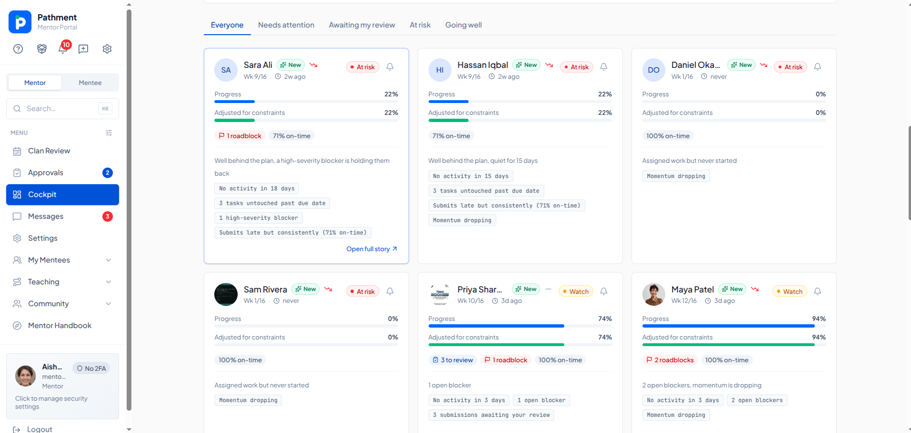
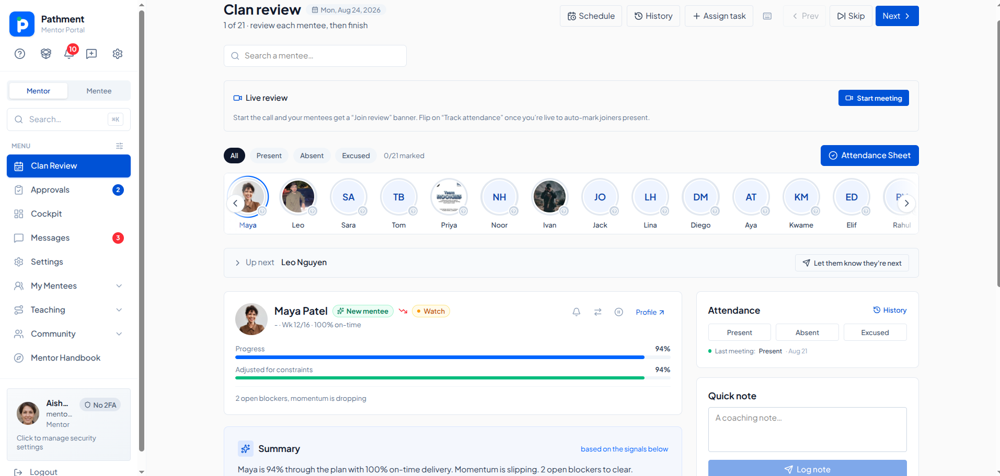
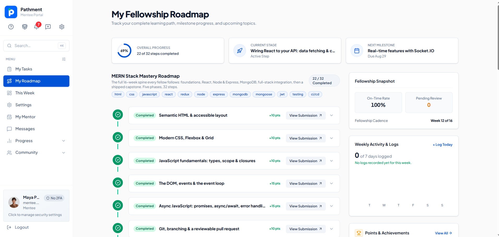
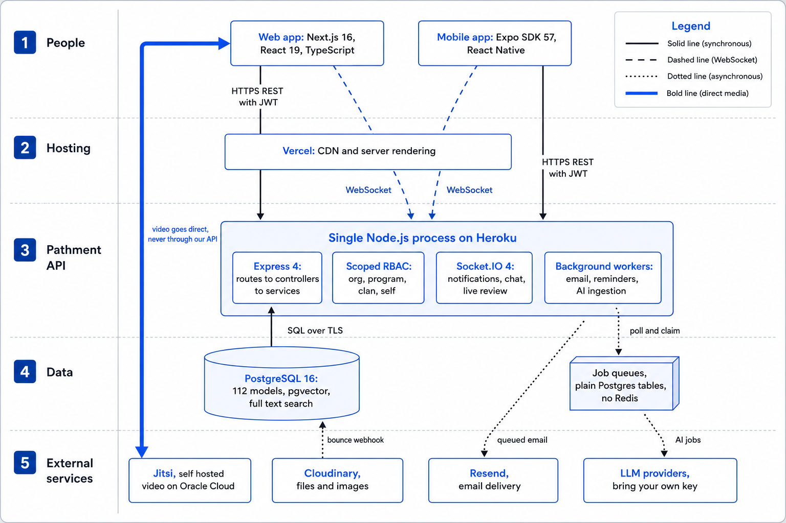
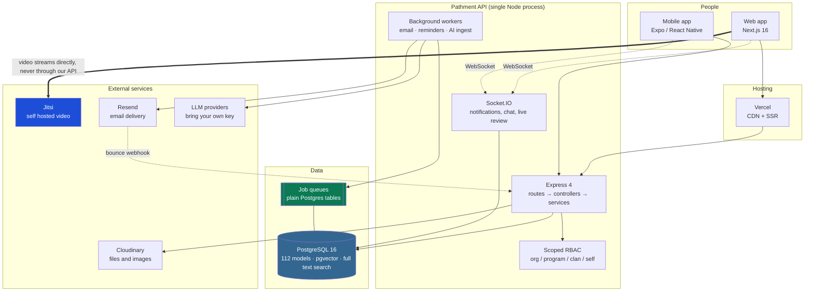

<div align="center">

# Pathment

**The operating system for mentor-led training programs.**

Run a fellowship, bootcamp, internship or onboarding cohort in one place, instead of a
pile of spreadsheets, Google Forms and Slack threads.

[**Live app**](https://devweekends.pathment.me) · [**Watch the 2 minute intro**](#-see-it-in-action) · [**Architecture**](#-how-it-is-built) · [**Docs**](docs/ARCHITECTURE.md) · [**Contributing**](CONTRIBUTING.md)


</div>

---

## What Pathment is

Pathment is an open source platform for organisations that grow people through
structured, mentor-led programs. Someone applies to a cohort, gets placed into a small
group called a **clan** with a mentor who is actually responsible for them, works through
a **roadmap** of real tasks, and gets those tasks reviewed by a human. Along the way there
is live video review, one to one scheduling, messaging, a community feed and progress
analytics, so nobody has to guess who is on track.

It is live and in production at [Dev Weekends](https://devweekends.pathment.me), with
**3,000+ registered users** and mentors using it every week to review work, run cohort
calls and track how their mentees are doing.

The short version: it turns `apply → assess → place → mentor → track → graduate` into one
system that is measurable and fair, instead of five tools that do not talk to each other.

---

## 🎬 See it in action

<div align="center">

[](https://youtu.be/wg1-BTJDbPE)

*Two minutes on what Pathment does and why it exists.*

</div>

---

## 📸 What it looks like

### The mentor cockpit

Every mentee in the clan on one screen, with progress, an on-time rate, and a plain
English reason for anyone who needs attention. The second bar, **adjusted for
constraints**, is progress recalculated against the delays and blockers a mentee actually
logged, so somebody juggling a full time job is not judged against somebody who is not.



### The weekly clan review

Work through all 21 mentees one at a time, with attendance, a summary of where each person
stands, and a place to leave a coaching note. Starting the meeting puts a "Join review"
banner in front of every mentee and marks people present as they arrive.



### The mentee roadmap

A mentee sees the whole 32 step path, not just the task in front of them. Where they are,
what is next, what it is worth, and how much of the fellowship is behind them.



---

## Who it is for

| Role | What they do here |
| --- | --- |
| **Admin** | Creates programs and cohorts, runs intake and applications, sets up clans, invites people, watches org wide health. |
| **Lead mentor** | Owns a clan. Assigns and reviews work, runs the weekly review call, holds one to ones, decides who is struggling. |
| **Co-mentor** | Helps run a clan with almost the same powers as the lead. The lead can switch individual permissions off per person. |
| **Mentee** | Works the roadmap, submits real work, gets feedback from a human, sees their own progress honestly. |

One account can hold several of these at once. Somebody can be a mentee in one clan while
co-mentoring another, which is normal in real programs and something most tools get wrong.

---

## ✨ What it does

**Intake and placement**
A public program catalog, shareable apply links, admin built assessments with question
pools, and accept to invite to placement in a single flow. No more copying names between
a form and a spreadsheet.

**Mentorship that scales**
Clans keep groups small. Shared roadmaps keep guidance consistent between mentors. Every
task goes through the same submit, review, feedback loop, so quality does not depend on
which mentor you happened to get.

**Live cohort reviews**
Weekly review calls run on self hosted Jitsi, embedded straight into the app. Attendance
is marked as people join, talk time feeds a contribution signal, and ending the call
finishes the session and awards points.

**Progress you can trust**
Enrollment progress is computed from real assigned tasks, not a field somebody typed.
Blockers, logged delays, risk scoring and mentor confirmed completion make it obvious who
is stuck and who is fine.

**Everything else in one place**
Real time messaging with delivery and read receipts, a community feed scoped to clan,
cohort, program or global, gamification with points, badges and a gift catalog, one to one
scheduling from mentor availability, quizzes, mock interviews with voice and code answers,
a shared resource library, and analytics for fairness and clan health.

**AI where it helps, off where it does not**
Bring your own API key. Roadmap generation, cohort report narratives, at risk detection and
interview grading all route through whichever provider you connect, per feature.

---

## 🏗️ How it is built



<details>
<summary>Same diagram as editable Mermaid source</summary>



</details>

### Stack

| Layer | Technology | Why this one |
| --- | --- | --- |
| Web app | Next.js 16 (App Router), React 19, TypeScript, Tailwind v4 | Server rendering where it helps, one language across the whole stack. |
| Mobile app | Expo SDK 57, React Native 0.86, TanStack Query | Same API, no second backend. Ships to both stores from one codebase. |
| API | Node.js 20, Express 4 | Boring on purpose. The interesting parts are in the services, not the framework. |
| Database | PostgreSQL 16, Sequelize 6 | One database doing relational data, full text search, vector search and job queues. Fewer moving parts to run. |
| Real time | Socket.IO 4 | Notifications, chat and live review presence over one authenticated connection. |
| Background jobs | Plain Postgres tables, no Redis | Enqueueing a job is part of the same transaction as the business write, so they can never disagree. |
| Video | Self hosted Jitsi (Prosody, Jicofo, JVB) | Video goes browser to bridge and never touches our API, so per minute cost is zero. |
| Email | Resend, behind our own queue | Retries, dead letter queue, suppression list and a bounce webhook. |
| Files | Cloudinary | Avatars, submissions and mentor uploads. |
| AI | OpenAI, Gemini, Groq, OpenRouter, Anthropic | Bring your own key, routed per feature. |
| Hosting | Vercel (web), Heroku (API and database), Oracle Cloud (video) | Staging runs the same shape on Render and Neon. |

---

## 🔬 Engineering worth a look

A few parts that were harder than they look, if you are reading the code to judge it.

**Job queues on plain Postgres**
No Redis and no Bull. Jobs are claimed with `SELECT ... FOR UPDATE SKIP LOCKED`, so
multiple workers are safe with zero coordination. Retries use exponential backoff with
jitter, failures land in a dead letter queue with the reason attached, and a suppression
list fed by bounce webhooks protects the sending domain.
→ [`server/src/services/emailService.js`](server/src/services/emailService.js)

**Idempotency in six places, five different ways**
Unique constraints, natural key dedupe, state guards, content hashing and check and reuse.
Awarding contribution points twice would quietly corrupt a leaderboard forever, so that
path is guarded by state rather than by a key.
→ [`server/src/services/reviewMeetingService.js`](server/src/services/reviewMeetingService.js)

**Auth that survives bad Wi-Fi**
Mentors were being logged out during live video calls. The cause was treating every failed
token refresh as an expired session, when most failures are just a dropped connection.
Refresh failures are now classified, renewal happens before expiry rather than after a
failure, and simultaneous retries collapse into one request.
→ [`client-interface/lib/services/auth-session.ts`](client-interface/lib/services/auth-session.ts)

**Permissions that are computed, not stored**
Roles are bound to a scope: org, program, clan or self. Capabilities are derived on every
request instead of read from a cached list, so removing somebody's role takes effect
immediately. A lead mentor can also switch off individual permissions for one co-mentor.
→ [`server/src/services/authzService.js`](server/src/services/authzService.js)

---

## 🚀 Try it locally

```bash
git clone https://github.com/pathment/pathment.git
cd pathment

# Backend
cd server && npm install
cp .env.example .env          # fill in DATABASE_URL and JWT secrets
npm run db:sync               # build the schema from the models
npm run seed:demo             # 26 mentees, 32 step roadmap, full demo data
npm run dev

# Frontend, in a second terminal
cd client-interface && npm install
echo "NEXT_PUBLIC_API_URL=http://localhost:5000/api" > .env.local
npm run dev
```

Open http://localhost:3000 and log in with any of these. The password is `Demo@1234`.

| Account | What you will see |
| --- | --- |
| `mentor.aisha@demo.pathment.com` | A clan of 20 mentees, mid cohort. Start here. |
| `mentor.sam@demo.pathment.com` | The same clan as a co-mentor, with analytics switched off. |
| `mentee.maya@demo.pathment.com` | A strong mentee, 21 of 32 steps done. |
| `admin@demo.pathment.com` | Intake, clans, analytics and the whole org. |

Full setup, environment variables and troubleshooting live in
**[CONTRIBUTING.md](CONTRIBUTING.md)** and **[docs/SETUP.md](docs/SETUP.md)**.

---

## 📱 Mobile app

Pathment also ships a native mobile app, built with Expo SDK 57 and React Native 0.86. It
talks to the same API as the web app, so there is no second backend and no duplicated
business logic. Mentees can check their roadmap, submit work, message their mentor and
receive push notifications.

The mobile source is kept in a private repository for now. The API it runs on is all here,
in this repository.

---

## 📚 Documentation

| Guide | What it covers |
| --- | --- |
| [docs/ARCHITECTURE.md](docs/ARCHITECTURE.md) | How the system fits together, how a request flows, the conventions every contributor follows. |
| [docs/DATABASE.md](docs/DATABASE.md) | The full data model, domain by domain, with diagrams. |
| [CONTRIBUTING.md](CONTRIBUTING.md) | Setup, branch names, pull request flow, review expectations. |

---

## 🤝 Contributing

Contributions are genuinely welcome, and there are already 15 people in the commit history.

1. Fork the repository
2. Branch as `feature/...`, `fix/...` or `docs/...`
3. Make focused changes and run the tests in `server/`
4. Open a pull request that explains the problem, not just the diff

Full guide, including local setup and what a good pull request looks like:
**[CONTRIBUTING.md](CONTRIBUTING.md)**

---

## 📄 License

Apache License 2.0. See [LICENSE](LICENSE).

You can use, modify and distribute this, including commercially. Apache 2.0 also grants
patent rights explicitly, which is why serious open source infrastructure tends to prefer
it over MIT.

---

<div align="center">

Built by [Sheryar Ahmed](https://github.com/Sheryar-Ahmed) and
[15 contributors](https://github.com/pathment/pathment/graphs/contributors).

If Pathment is useful to you, a star helps other people find it.

</div>
